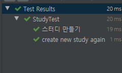

# 인프런 - 더 자바 코드를 테스트하는 다양한 방법 - 백기선 님 강의
---

## [1. JUnit5](#JUnit5)
* [JUnit 5 소개](#JUnit5-소개)
* [JUnit 5 시작하기](#JUnit-5-시작하기)
* [JUnit 5 테스트 이름 표시하기](#JUnit-5-테스트-이름-표시하기)
* [JUnit 5 Assertion](#JUnit-5-Assertion)
* [JUnit 5 조건에 따라 테스트 실행하기](#JUnit-5-조건에-따라-테스트-실행하기)
* [JUnit 5 태깅과 필터링](#JUnit-5-태깅과-필터링)
* [JUnit 5 커스텀 태그](#JUnit-5-커스텀-태그)
* [JUnit 5 테스트 반복하기 1부](#JUnit-5-테스트-반복하기-1부)
* [JUnit 5 테스트 반복하기 1부](#JUnit-5-테스트-반복하기-1부)
* [JUnit 5 테스트 반복하기 2부](#JUnit-5-테스트-반복하기-2부)
* [JUnit 5 테스트 인스턴스](#JUnit-5-테스트-인스턴스)
* [JUnit 5 테스트 순서](#JUnit-5-테스트-순서)
* [JUnit 5 junit-platform.properties](#JUnit-5-junit-platform.properties)
* [JUnit 5 확장 모델](#JUnit-5-확장-모델)
* [JUnit 5 마이그레이션](#JUnit-5-마이그레이션)
* [JUnit 5 연습 문제](#JUnit-5-연습-문제)
 
## [섹션 1. Mockito](#섹션-1.-Mockito)
* [Mockito 소개](#Mockito-소개)
* [Mockito 시작하기](#Mockito-시작하기)
* [Mock 객체 만들기](#Mock-객체-만들기)
* [Mock 객체 Stubbing](#Mock-객체-Stubbing)
* [Mock 객체 Stubbing 연습 문제](#Mock-객체-Stubbing-연습-문제)
* [Mock 객체 확인](#Mock-객체-확인)
* [BDD 스타일 Mockito API](#BDD-스타일-Mockito-API)
* [Mockito 연습 문제](#Mockito-연습-문제)

## [섹션 2. 도커와 테스트](#섹션-2.-도커와-테스트)
* [Testcontainers 소개](#Testcontainers-소개)
* [Testcontainers 설치](#Testcontainers-설치)
* [Testcontainers 기능 살펴보기](#Testcontainers-기능-살펴보기)
* [컨테이너 정보를 스프링 테스트에서 참조하기](#컨테이너-정보를-스프링-테스트에서-참조하기)
* [Testcontainers 도커 Compose 사용하기 1부](#Testcontainers-도커-Compose-사용하기-1부)
* [Testcontainers 도커 Compose 사용하기 2부](#Testcontainers-도커-Compose-사용하기-2부)

## [섹션 3. 성능 테스트](#섹션-3.-성능-테스트)
* [JMeter 소개](#JMeter-소개)
* [JMeter 설치](#JMeter-설치)
* [JMeter 사용하기](#JMeter-사용하기)

## [섹션 4. 운영 이슈 테스트](#섹션-4.-운영-이슈-테스트)
* [Chaos Monkey 소개](#Chaos-Monkey-소개)
* [CM4SB 설치](#CM4SB-설치)
* [CM4SB 응답 지연](#CM4SB-응답-지연)
* [CM4SB 에러 발생](#CM4SB-에러-발생)

## [섹션 5. 아키텍처 테스트](#섹션-5.-아키텍처-테스트)
* [ArchUnit 소개](#ArchUnit-소개)
* [ArchUnit 설치](#ArchUnit-설치)
* [ArchUnit 패키지 의존성 확인하기](#ArchUnit-패키지-의존성-확인하기)
* [ArchUnit JUnit 5 연동](#ArchUnit-JUnit-5-연동)
* [ArchUnit 클래스 의존성 확인하기](#ArchUnit-클래스-의존성-확인하기)
## [섹션 6. 정리](#섹션-6.-정리)
* [마무리](#마무리)


### JUnit 5 소개
자바 개발자가 가장 많이 사용하는 테스팅 프레임워크
* 자바 8 이상 필요
  
  
* 참고 레퍼런스 : https://junit.org/junit5/docs/current/user-guide/ 


### JUnit 5 시작하기

* Maven 기준 JUnit5 dependency
```
<dependency>
    <groupId>org.junit.jupiter</groupId>
    <artifactId>junit-jupiter-engine</artifactId>
    <version>5.5.2</version>
    <scope>test</scope>
</dependency>
```

* 2.2 이상의 버전의 스프링 부트 프로젝트를 만든다면 기본으로 JUnit 5 의존성 추가 됨

기본 애노테이션
* @Test         : @Test가 선언된 메서드는 테스트를 수행하는 메소드  
    * jUnit은 각각의 테스트가 서로 영향을 주지 않고 독립적으로 실행됨을 원칙으로 @Test마다 객체를 생성한다.
* @BeforeAll    : 테스트 클래스 안에 있는 모든 테스트가 실행하기 전에 반드시 1번 실행 되는 메서드. 반드시 `static void`를 사용.  
* @AfterAll     : 모든 테스트 실행된 이후에 반드시 1번 실행. 반드시 `static void`를 사용 
* @BeforeEach   : 모든 테스트 실행되기 이전에 한번씩 호출 `static` 일 필요는 없다. 
* @AfterEach    : 모든 테스트 실행되기 이후에 한번씩 호출 `static` 일 필요는 없다. 
* @Disabled     : 실행하고 싶지 않는 테스트 메서드에 사용.
    * @ignore 애노테이션이랑 매핑됨(비슷한 동작을 한다)
 
단위테스트(Unit Test)란?

- 소스코드의 특정 모듈이 의도된 대로 정확히 작동하는지 검증하는 절차이다.

- 모든 함수와 메소드에 대한 테스트 케이스(Test case)를 작성하는 절차를 말한다.

- jUnit은 보이지 않고 숨겨진 단위 테스트를 끌어내어 정형화시켜 단위테스트를 쉽게 해주는 테스트 지원 프레임워크이다.
 
> Junit 테스트는 보통 언더바로 메서드 이름을 표시한다. ex) create_new_object()

### JUnit 5 테스트 이름 표시하기

* @DisplayNameGeneration
  * Method와 Class 레퍼런스를 사용해서 테스트 이름을 표기하는 방법 설정. (둘다 사용 가능)
    * ```java
      @DisplayNameGeneration(DisplayNameGenerator.ReplaceUnderscores.class)
        class StudyTest { ... }
      ```
       이런 방식으로 전략을 설정해 줄 수 있다. 클래스 레퍼런스 하면 클래스 내 모든 메서드에 적용된다. 
  
  * 기본 구현체로 ReplaceUnderscores 제공
   
* @DisplayName
  * 어떤 테스트인지 테스트 이름을 보다 쉽게 표현할 수 있는 방법을 제공하는 애노테이션.
  * @DisplayNameGeneration 보다 우선 순위가 높다. 
  * 메서드 마다 지정할 수 있다.
    * , 

* 참고 레퍼런스 : https://junit.org/junit5/docs/current/user-guide/#writing-tests-display-names

### JUnit 5 Assertion

실제 테스트에서 검증하고자 할떄 사용하는 기능

* 패키지 org.junit.jupiter.api.Assertions

| 메서드 명| 기능 |
|-----|----|
|assertEqulas(expected, actual)| 실제 값이 기대한 값과 같은지 확인|
|assertNotNull(actual)| 값이 null이 아닌지 확인 |
|assertTrue(boolean)| 다음 조건이 참(true)인지 확인 |
|assertAll(executables...)| 모든 확인 구문 확인 |
|assertThrows(expectedType, executable)| 예외 발생 확인.  어떤 예외가 발생하는지 비교, 파라미터를 리턴 받아서 어떤 예외인지 알 수 있다. |
|assertTimeout(duration, executable)|특정 시간 안에 실행이 완료되는지 확인 |

* 메서드 마지막 매개변수로 메시지를 줄 수 있는데,  
  * Supplier < String > 타입의 인스턴스를 람다 형태로 제공할 수 있다


* 첫번째 assert 깨지면 다음 assert는 실행 되지 않는다.
* assertAll을 사용하면 모든 테스트가 실행되게 할 수 있다.
  *   

* assertTimeOut 

* AssertJ​, ​Hemcrest​, ​Truth​ 등의 라이브러리를 사용할 수도 있다
  * https://joel-costigliola.github.io/assertj/
  * https://hamcrest.org/JavaHamcrest/javadoc/
  * https://truth.dev/
  

### JUnit 5 조건에 따라 테스트 실행하기
특정한 조건을 만족하는 경우에 테스트를 실행하는 방법.
* #### org.junit.jupiter.api.Assumptions.*
* assumeTrue(조건)
* assumingThat(조건, 테스트)

@Enabled___ 와 @Disabled___
* OnOS : 특정 OS
* OnJre : 특정 자바 버전
* IfSystemProperty
* IfEnvironmentVariable : 환경변수에 맞춰 Enable, disable
* If

### JUnit 5 태깅과 필터링
테스트 태깅 : 여러 테스트들을 테스트 그룹을 만들고 원하는 테스트 그룹만 테스트를 실행할 수 있는 기능.

* @Tag
  * 테스트 메소드에 태그를 추가할 수 있다.
  * 하나의 테스트 메소드에 여러 태그를 사용할 수 있다

인텔리J에서 특정 태그로 테스트 필터링 하는 방법
특정 테스트 Edit Configuration -> Test kind 를 Tags로 수정 -> Tag expression 에 태그명 입력

메이븐에서 테스트 필터링 하는 방법

```
<plugin>
    <artifactId>maven-surefire-plugin</artifactId>
    <configuration>
        <groups>fast | slow</groups>
    </configuration>
</plugin>
```
-> fast나 slow 태그가 붙은 테스트만 실행 

* https://junit.org/junit5/docs/current/user-guide/#running-tests-tag-expressions

### JUnit 5 커스텀 태그

JUnit 5 애노테이션을 조합하여 커스텀 태그를 만들 수 있다.
```java
@Retention(RetentionPolicy.RUNTIME)
@Target(ElementType.METHOD)
@Test
@Tag("fast")
public @interface FastTest {...}// 우리가 새로 만든 어노테이션 
```
---
```java
@Test
@DisplayName("fast 그룹 테스트 1")
@Tag("fast")
void test_fast1() {...}
```

#### 위를 다음과 같이 변경이 가능하다. 

```java
@FastTest
@DisplayName("fast 그룹 테스트 1")
void custom_test_fast1() {...}
```

---
### JUnit 5 테스트 반복하기 1부

반복해서 테스트를 하고 싶을 때 사용

* @RepeatedTest
* 반복 횟수와 반복 테스트 이름을 설정할 수 있다.
  * @RepeatedTest(value, name ) 옵션들
    * {displayName}
    * {currentRepetition}
    * {totalRepetitions}
  * RepetitionInfo 타입의 인자를 받을 수 있다.
  * ```java
    @RepeatedTest(10)
    void repeatTest(RepetitionInfo repetitionInfo) {
        System.out.println("반복 테스트 " +
                repetitionInfo.getCurrentRepetition() + " \n" + // 현재 반복 횟수 
                repetitionInfo.getTotalRepetitions()); // 총 반복 횟수(10)
    }
    ```
  * 어노테이션의 name속성에 다음과 같이 이름도 줄 수 있다
  * ```java
    @DisplayName("반복 테스트 ")
    @RepeatedTest(value = 10, name = "{displayName}, ! {currentRepetition} / {totalRepetition}")
    void repeatTest(RepetitionInfo repetitionInfo) {
        System.out.println("반복 테스트 " +
                repetitionInfo.getCurrentRepetition() + " \n" +
                repetitionInfo.getTotalRepetitions());
    }
    ```
    

--- 

* @ParameterizedTest
* 테스트에 여러 다른 매개변수를 대입해가며 반복 실행한다.
  * @ParameterizedTest(name = "")의 옵션들 
    * {displayName}
    * {index}
    * {arguments}
    * {0}, {1}, ...
  * ```java
    @ParameterizedTest
    @ValueSource(strings = {"날씨가", "많이", "추워지고", "있습니다."})
    void parameterizedTest(String message) {
        System.out.println(message); // 날씨가 \n 많이 \n 추워지고 \n 있습니다. \n
    }
    ```
    * ValueSource의 인자를 하나씩 루프를 돌며 출력

### JUnit 5 테스트 반복하기 2부
#### 인자 값들의 소스
* 인자 값은 객체로도 받을 수 있다.(ex Study, User, UserDto 등) 
* 인자 값(위 예제에서는 String message)에 어노테이션 이름에 맞는 값을 `인자`에 넣어줌
  * Null 이면 Null, Empty면 ""(빈값)

* @ValueSource
* @NullSource, @EmptySource, @NullAndEmptySource 
* @EnumSource
* @MethodSource
* @CvsSource
* @CvsFileSource
* @ArgumentSource

#### 인자 값 타입 변환
* 암묵적인 타입 변환
  * 레퍼런스​ 참고
* 명시적인 타입 변환
  * SimpleArgumentConverter 상속 받은 구현체 제공
  * @ConvertWith

```java
    static class StudyConverter extends SimpleArgumentConverter {
        @Override
        protected Object convert(Object o, Class<?> aClass) throws ArgumentConversionException {
            assertEquals(Study.class, aClass, "Can only convert to Study");
            return new Study(Integer.parseInt(o.toString()));
        }
    }
    
    @DisplayName("컨버터 테스트")
    @ParameterizedTest(name = "{index} {displayName} message = {0}")
    @ValueSource(ints = {10, 20, 40})
    void parameterizedTest2(@ConvertWith(StudyConverter.class) Study study) {
        System.out.println(study.getLimit());
    }
```

SimpleArgumentConverter를 상속받은 컨버터 클래스를 정의하고   
@ConvertWith 어노테이션과 함께 사용할 수 있다.  
* ArgumentConverter는 하나의 인자값에만 사용 가능! 
* 여러개의 인자값을 사용할려면 `ArgmentsAccessor`를 사용해야 한다
  
####인자 값 조합
* ArgumentsAccessor
* 커스텀 Accessor
    * [ArgumentsAggregator 인터페이스 구현](#Custom한-Aggregator를-만들면-된다)
    * @AggregateWith
  
```java
@DisplayName("컨버터 테스트")
    @ParameterizedTest(name = "{index} {displayName} message = {0}")
    @CsvSource({"10, '자바 스터디'", "20, 스프링"}) // '' 공백을 포함한 문자열을 넣을때 사용
    void parameterizedTest3(ArgumentsAccessor argumentsAccessor) {
        Study study =
                new Study(argumentsAccessor.getInteger(0), argumentsAccessor.getString(1));
        System.out.println(study);
    }

```
* ArgumentsAccessor로 부터 인자를 받아 new 인스턴스를 만들어주기도 귀찮다면 ?
* ##### Custom한 `Aggregator`를 만들면 된다. (ArgumentsAggregator 인터페이스를 구현 )
    * `@AggregateWith` 어노테이션을 사용해서 인자로 받는다 
```java
    //Aggregator 인터페이스 구현 
    static class StudyAggregator implements ArgumentsAggregator {
        @Override
        public Object aggregateArguments(ArgumentsAccessor argumentsAccessor,
                                         ParameterContext parameterContext) 
                throws ArgumentsAggregationException {

            return new Study(argumentsAccessor.getInteger(0), argumentsAccessor.getString(1));
        }
    }
    
    @DisplayName("컨버터 테스트")
    @ParameterizedTest(name = "{index} {displayName} message = {0}")
    @CsvSource({"10, '자바 스터디'", "20, 스프링"})// '' 공백을 포함한 문자열을 넣을때 사용
    void parameterizedTest4(@AggregateWith(StudyAggregator.class) Study study) {
        System.out.println(study);
    }

```
* ArgumentsAggregator를 구현한 클래스의 제약조건
  * 반드시 `static inner class` 이거나 `public class` 여야 한다. 

#### 참고
* https://junit.org/junit5/docs/current/user-guide/#writing-tests-parameterized-tests

---
### JUnit 5 테스트 인스턴스
JUnit은 테스트 메소드 마다 테스트 인스턴스를 새로 만든다.
- 이것이 기본 전략.
- 테스트 메소드를 독립적으로 실행하여 예상치 못한 부작용을 방지하기 위함이다.
- 이 전략을 JUnit 5에서 변경할 수 있다.

### JUnit 5 테스트 순서


### JUnit 5 junit-platform.properties


### JUnit 5 확장 모델


### JUnit 5 마이그레이션


### JUnit 5 연습 문제


## 섹션 1. Mockito


### Mockito 소개


### Mockito 시작하기


### Mock 객체 만들기


### Mock 객체 Stubbing


### Mock 객체 Stubbing 연습 문제


### Mock 객체 확인


### BDD 스타일 Mockito API


### Mockito 연습 문제


## 섹션 2. 도커와 테스트


### Testcontainers 소개


### Testcontainers 설치


### Testcontainers 기능 살펴보기


### 컨테이너 정보를 스프링 테스트에서 참조하기


### Testcontainers 도커 Compose 사용하기 1부


### Testcontainers 도커 Compose 사용하기 2부


## 섹션 3. 성능 테스트


### JMeter 소개


### JMeter 설치


### JMeter 사용하기


## 섹션 4. 운영 이슈 테스트


### Chaos Monkey 소개


### CM4SB 설치


### CM4SB 응답 지연


### CM4SB 에러 발생


## 섹션 5. 아키텍처 테스트


### ArchUnit 소개


### ArchUnit 설치


### ArchUnit 패키지 의존성 확인하기


### ArchUnit JUnit 5 연동


### ArchUnit 클래스 의존성 확인하기


## 섹션 6. 정리


### 마무리


