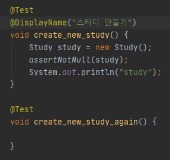

# 인프런 - 더 자바 코드를 테스트하는 다양한 방법 - 백기선 님 강의
---

## [1. JUnit5](#JUnit5)
* [JUnit 5 소개](#JUnit5-소개)
* [JUnit 5 시작하기](#JUnit-5-시작하기)
* [JUnit 5 테스트 이름 표시하기](#JUnit-5-테스트-이름-표시하기)
* [JUnit 5 Assertion](#JUnit-5-Assertion)
* [JUnit 5 조건에 따라 테스트 실행하기](#JUnit-5-조건에-따라-테스트-실행하기)
* [JUnit 5 태깅과 필터링](#JUnit-5-태깅과-필터링)
* [JUnit 5 커스텀 태그](#JUnit-5-커스텀-태그)
* [JUnit 5 테스트 반복하기 1부](#JUnit-5-테스트-반복하기-1부)
* [JUnit 5 테스트 반복하기 1부](#JUnit-5-테스트-반복하기-1부)
* [JUnit 5 테스트 반복하기 2부](#JUnit-5-테스트-반복하기-2부)
* [JUnit 5 테스트 인스턴스](#JUnit-5-테스트-인스턴스)
* [JUnit 5 테스트 순서](#JUnit-5-테스트-순서)
* [JUnit 5 junit-platform.properties](#JUnit-5-junit-platform.properties)
* [JUnit 5 확장 모델](#JUnit-5-확장-모델)
* [JUnit 5 마이그레이션](#JUnit-5-마이그레이션)
* [JUnit 5 연습 문제](#JUnit-5-연습-문제)
 
## [섹션 1. Mockito](#섹션-1.-Mockito)
* [Mockito 소개](#Mockito-소개)
* [Mockito 시작하기](#Mockito-시작하기)
* [Mock 객체 만들기](#Mock-객체-만들기)
* [Mock 객체 Stubbing](#Mock-객체-Stubbing)
* [Mock 객체 Stubbing 연습 문제](#Mock-객체-Stubbing-연습-문제)
* [Mock 객체 확인](#Mock-객체-확인)
* [BDD 스타일 Mockito API](#BDD-스타일-Mockito-API)
* [Mockito 연습 문제](#Mockito-연습-문제)

## [섹션 2. 도커와 테스트](#섹션-2.-도커와-테스트)
* [Testcontainers 소개](#Testcontainers-소개)
* [Testcontainers 설치](#Testcontainers-설치)
* [Testcontainers 기능 살펴보기](#Testcontainers-기능-살펴보기)
* [컨테이너 정보를 스프링 테스트에서 참조하기](#컨테이너-정보를-스프링-테스트에서-참조하기)
* [Testcontainers 도커 Compose 사용하기 1부](#Testcontainers-도커-Compose-사용하기-1부)
* [Testcontainers 도커 Compose 사용하기 2부](#Testcontainers-도커-Compose-사용하기-2부)

## [섹션 3. 성능 테스트](#섹션-3.-성능-테스트)
* [JMeter 소개](#JMeter-소개)
* [JMeter 설치](#JMeter-설치)
* [JMeter 사용하기](#JMeter-사용하기)

## [섹션 4. 운영 이슈 테스트](#섹션-4.-운영-이슈-테스트)
* [Chaos Monkey 소개](#Chaos-Monkey-소개)
* [CM4SB 설치](#CM4SB-설치)
* [CM4SB 응답 지연](#CM4SB-응답-지연)
* [CM4SB 에러 발생](#CM4SB-에러-발생)

## [섹션 5. 아키텍처 테스트](#섹션-5.-아키텍처-테스트)
* [ArchUnit 소개](#ArchUnit-소개)
* [ArchUnit 설치](#ArchUnit-설치)
* [ArchUnit 패키지 의존성 확인하기](#ArchUnit-패키지-의존성-확인하기)
* [ArchUnit JUnit 5 연동](#ArchUnit-JUnit-5-연동)
* [ArchUnit 클래스 의존성 확인하기](#ArchUnit-클래스-의존성-확인하기)
## [섹션 6. 정리](#섹션-6.-정리)
* [마무리](#마무리)


### JUnit 5 소개
자바 개발자가 가장 많이 사용하는 테스팅 프레임워크
* 자바 8 이상 필요
  
  
* 참고 레퍼런스 : https://junit.org/junit5/docs/current/user-guide/ 


### JUnit 5 시작하기

* Maven 기준 JUnit5 dependency
```
<dependency>
    <groupId>org.junit.jupiter</groupId>
    <artifactId>junit-jupiter-engine</artifactId>
    <version>5.5.2</version>
    <scope>test</scope>
</dependency>
```

* 2.2 이상의 버전의 스프링 부트 프로젝트를 만든다면 기본으로 JUnit 5 의존성 추가 됨

기본 애노테이션
* @Test         : @Test가 선언된 메서드는 테스트를 수행하는 메소드  
    * jUnit은 각각의 테스트가 서로 영향을 주지 않고 독립적으로 실행됨을 원칙으로 @Test마다 객체를 생성한다.
* @BeforeAll    : 테스트 클래스 안에 있는 모든 테스트가 실행하기 전에 반드시 1번 실행 되는 메서드. 반드시 `static void`를 사용.  
* @AfterAll     : 모든 테스트 실행된 이후에 반드시 1번 실행. 반드시 `static void`를 사용 
* @BeforeEach   : 모든 테스트 실행되기 이전에 한번씩 호출 `static` 일 필요는 없다. 
* @AfterEach    : 모든 테스트 실행되기 이후에 한번씩 호출 `static` 일 필요는 없다. 
* @Disabled     : 실행하고 싶지 않는 테스트 메서드에 사용.
    * @ignore 애노테이션이랑 매핑됨(비슷한 동작을 한다)
 
단위테스트(Unit Test)란?

- 소스코드의 특정 모듈이 의도된 대로 정확히 작동하는지 검증하는 절차이다.

- 모든 함수와 메소드에 대한 테스트 케이스(Test case)를 작성하는 절차를 말한다.

- jUnit은 보이지 않고 숨겨진 단위 테스트를 끌어내어 정형화시켜 단위테스트를 쉽게 해주는 테스트 지원 프레임워크이다.
 
> Junit 테스트는 보통 언더바로 메서드 이름을 표시한다. ex) create_new_object()

### JUnit 5 테스트 이름 표시하기

* @DisplayNameGeneration
  * Method와 Class 레퍼런스를 사용해서 테스트 이름을 표기하는 방법 설정. (둘다 사용 가능)
    * ```java
      @DisplayNameGeneration(DisplayNameGenerator.ReplaceUnderscores.class)
        class StudyTest { ... }
      ```
       이런 방식으로 전략을 설정해 줄 수 있다. 클래스 레퍼런스 하면 클래스 내 모든 메서드에 적용된다. 
  
  * 기본 구현체로 ReplaceUnderscores 제공
   
* @DisplayName
  * 어떤 테스트인지 테스트 이름을 보다 쉽게 표현할 수 있는 방법을 제공하는 애노테이션.
  * @DisplayNameGeneration 보다 우선 순위가 높다. 
  * 메서드 마다 지정할 수 있다.
    * , 

* 참고 레퍼런스 : https://junit.org/junit5/docs/current/user-guide/#writing-tests-display-names

### JUnit 5 Assertion

실제 테스트에서 검증하고자 할떄 사용하는 기능

* 패키지 org.junit.jupiter.api.Assertions

| 메서드 명| 기능 |
|-----|----|
|assertEqulas(expected, actual)| 실제 값이 기대한 값과 같은지 확인|
|assertNotNull(actual)| 값이 null이 아닌지 확인 |
|assertTrue(boolean)| 다음 조건이 참(true)인지 확인 |
|assertAll(executables...)| 모든 확인 구문 확인 |
|assertThrows(expectedType, executable)| 예외 발생 확인.  어떤 예외가 발생하는지 비교, 파라미터를 리턴 받아서 어떤 예외인지 알 수 있다. |
|assertTimeout(duration, executable)|특정 시간 안에 실행이 완료되는지 확인 |

* 메서드 마지막 매개변수로 메시지를 줄 수 있는데,  
  * Supplier < String > 타입의 인스턴스를 람다 형태로 제공할 수 있다


* 첫번째 assert 깨지면 다음 assert는 실행 되지 않는다.
* assertAll을 사용하면 모든 테스트가 실행되게 할 수 있다.
  *   

* assertTimeOut 

* AssertJ​, ​Hemcrest​, ​Truth​ 등의 라이브러리를 사용할 수도 있다
  * https://joel-costigliola.github.io/assertj/
  * https://hamcrest.org/JavaHamcrest/javadoc/
  * https://truth.dev/
  

### JUnit 5 조건에 따라 테스트 실행하기
특정한 조건을 만족하는 경우에 테스트를 실행하는 방법.
* #### org.junit.jupiter.api.Assumptions.*
* assumeTrue(조건)
* assumingThat(조건, 테스트)

@Enabled___ 와 @Disabled___
* OnOS : 특정 OS
* OnJre : 특정 자바 버전
* IfSystemProperty
* IfEnvironmentVariable : 환경변수에 맞춰 Enable, disable
* If

### JUnit 5 태깅과 필터링
테스트 태깅 : 여러 테스트들을 테스트 그룹을 만들고 원하는 테스트 그룹만 테스트를 실행할 수 있는 기능.

* @Tag
  * 테스트 메소드에 태그를 추가할 수 있다.
  * 하나의 테스트 메소드에 여러 태그를 사용할 수 있다

인텔리J에서 특정 태그로 테스트 필터링 하는 방법
특정 테스트 Edit Configuration -> Test kind 를 Tags로 수정 -> Tag expression 에 태그명 입력

메이븐에서 테스트 필터링 하는 방법

```
<plugin>
    <artifactId>maven-surefire-plugin</artifactId>
    <configuration>
        <groups>fast | slow</groups>
    </configuration>
</plugin>
```
-> fast나 slow 태그가 붙은 테스트만 실행 

* https://junit.org/junit5/docs/current/user-guide/#running-tests-tag-expressions

### JUnit 5 커스텀 태그

JUnit 5 애노테이션을 조합하여 커스텀 태그를 만들 수 있다.
```java
@Retention(RetentionPolicy.RUNTIME)
@Target(ElementType.METHOD)
@Test
@Tag("fast")
public @interface FastTest {...}// 우리가 새로 만든 어노테이션 
```
---
```java
@Test
@DisplayName("fast 그룹 테스트 1")
@Tag("fast")
void test_fast1() {...}
```

#### 위를 다음과 같이 변경이 가능하다. 

```java
@FastTest
@DisplayName("fast 그룹 테스트 1")
void custom_test_fast1() {...}
```

---
### JUnit 5 테스트 반복하기 1부

반복해서 테스트를 하고 싶을 때 사용

* @RepeatedTest
* 반복 횟수와 반복 테스트 이름을 설정할 수 있다.
  * @RepeatedTest(value, name ) 옵션들
    * {displayName}
    * {currentRepetition}
    * {totalRepetitions}
  * RepetitionInfo 타입의 인자를 받을 수 있다.
  * ```java
    @RepeatedTest(10)
    void repeatTest(RepetitionInfo repetitionInfo) {
        System.out.println("반복 테스트 " +
                repetitionInfo.getCurrentRepetition() + " \n" + // 현재 반복 횟수 
                repetitionInfo.getTotalRepetitions()); // 총 반복 횟수(10)
    }
    ```
  * 어노테이션의 name속성에 다음과 같이 이름도 줄 수 있다
  * ```java
    @DisplayName("반복 테스트 ")
    @RepeatedTest(value = 10, name = "{displayName}, ! {currentRepetition} / {totalRepetition}")
    void repeatTest(RepetitionInfo repetitionInfo) {
        System.out.println("반복 테스트 " +
                repetitionInfo.getCurrentRepetition() + " \n" +
                repetitionInfo.getTotalRepetitions());
    }
    ```
    

--- 

* @ParameterizedTest
* 테스트에 여러 다른 매개변수를 대입해가며 반복 실행한다.
  * @ParameterizedTest(name = "")의 옵션들 
    * {displayName}
    * {index}
    * {arguments}
    * {0}, {1}, ...
  * ```java
    @ParameterizedTest
    @ValueSource(strings = {"날씨가", "많이", "추워지고", "있습니다."})
    void parameterizedTest(String message) {
        System.out.println(message); // 날씨가 \n 많이 \n 추워지고 \n 있습니다. \n
    }
    ```
    * ValueSource의 인자를 하나씩 루프를 돌며 출력

### JUnit 5 테스트 반복하기 2부
#### 인자 값들의 소스
* 인자 값은 객체로도 받을 수 있다.(ex Study, User, UserDto 등) 
* 인자 값(위 예제에서는 String message)에 어노테이션 이름에 맞는 값을 `인자`에 넣어줌
  * Null 이면 Null, Empty면 ""(빈값)

* @ValueSource
* @NullSource, @EmptySource, @NullAndEmptySource 
* @EnumSource
* @MethodSource
* @CvsSource
* @CvsFileSource
* @ArgumentSource

#### 인자 값 타입 변환
* 암묵적인 타입 변환
  * 레퍼런스​ 참고
* 명시적인 타입 변환
  * SimpleArgumentConverter 상속 받은 구현체 제공
  * @ConvertWith

```java
    static class StudyConverter extends SimpleArgumentConverter {
        @Override
        protected Object convert(Object o, Class<?> aClass) throws ArgumentConversionException {
            assertEquals(Study.class, aClass, "Can only convert to Study");
            return new Study(Integer.parseInt(o.toString()));
        }
    }
    
    @DisplayName("컨버터 테스트")
    @ParameterizedTest(name = "{index} {displayName} message = {0}")
    @ValueSource(ints = {10, 20, 40})
    void parameterizedTest2(@ConvertWith(StudyConverter.class) Study study) {
        System.out.println(study.getLimit());
    }
```

SimpleArgumentConverter를 상속받은 컨버터 클래스를 정의하고   
@ConvertWith 어노테이션과 함께 사용할 수 있다.  
* ArgumentConverter는 하나의 인자값에만 사용 가능! 
* 여러개의 인자값을 사용할려면 `ArgmentsAccessor`를 사용해야 한다
  
####인자 값 조합
* ArgumentsAccessor
* 커스텀 Accessor
    * [ArgumentsAggregator 인터페이스 구현](#Custom한-Aggregator를-만들면-된다)
    * @AggregateWith
  
```java
@DisplayName("컨버터 테스트")
    @ParameterizedTest(name = "{index} {displayName} message = {0}")
    @CsvSource({"10, '자바 스터디'", "20, 스프링"}) // '' 공백을 포함한 문자열을 넣을때 사용
    void parameterizedTest3(ArgumentsAccessor argumentsAccessor) {
        Study study =
                new Study(argumentsAccessor.getInteger(0), argumentsAccessor.getString(1));
        System.out.println(study);
    }

```
* ArgumentsAccessor로 부터 인자를 받아 new 인스턴스를 만들어주기도 귀찮다면 ?
* ##### Custom한 `Aggregator`를 만들면 된다. (ArgumentsAggregator 인터페이스를 구현 )
    * `@AggregateWith` 어노테이션을 사용해서 인자로 받는다 
```java
    //Aggregator 인터페이스 구현 
    static class StudyAggregator implements ArgumentsAggregator {
        @Override
        public Object aggregateArguments(ArgumentsAccessor argumentsAccessor,
                                         ParameterContext parameterContext) 
                throws ArgumentsAggregationException {

            return new Study(argumentsAccessor.getInteger(0), argumentsAccessor.getString(1));
        }
    }
    
    @DisplayName("컨버터 테스트")
    @ParameterizedTest(name = "{index} {displayName} message = {0}")
    @CsvSource({"10, '자바 스터디'", "20, 스프링"})// '' 공백을 포함한 문자열을 넣을때 사용
    void parameterizedTest4(@AggregateWith(StudyAggregator.class) Study study) {
        System.out.println(study);
    }

```
* ArgumentsAggregator를 구현한 클래스의 제약조건
  * 반드시 `static inner class` 이거나 `public class` 여야 한다. 

#### 참고
* https://junit.org/junit5/docs/current/user-guide/#writing-tests-parameterized-tests

---
### JUnit 5 테스트 인스턴스
JUnit은 테스트 메소드 마다 테스트 인스턴스를 새로 만든다.
- 이것이 기본 전략.
- 테스트 메소드를 독립적으로 실행하여 예상치 못한 부작용을 방지하기 위함이다.
- 이 전략을 JUnit 5에서 변경할 수 있다.
  * 즉 테스트마다 `필드`를 공유하지 않는다.
  * 테스트 메서드마다 System.out.println(this) 를 찍어보면 인스턴스가 다르단 걸 알 수 있다. 

#### `@TestInstance(Lifecycle.PER_CLASS)`

- 테스트 클래스당 인스턴스를 하나만 만들어 사용한다. -> 하나의 인스턴스를 공유한다
- 경우에 따라, 테스트 간에 공유하는 모든 상태를 @BeforeEach 또는 @AfterEach에서
초기화 할 필요가 있다.
- @BeforeAll과 @AfterAll을 인스턴스 메소드 또는 인터페이스에 정의한 default 메소드로
정의할 수도 있다.
   * 이걸 사용하면 static 키워드가 필요한 메소드에서 static이 필요 없게 된다.  

### JUnit 5 테스트 순서

* 제대로 된 단위 테스트라면, 다른 테스트와 동시에 실행되더라도 다른 테스트 코드에 영향을 주지 않는다. 
  * 서로간에 의존성이 없어야 한다. (다른 코드에 영향 x)
  * 그래서 순서가 상관이 없어야 한다. 
 

실행할 테스트 메소드 특정한 순서에 의해 실행되지만  
어떻게 그 순서를 정하는지는 분명히 하지 않는다.  
(테스트 인스턴스를 테스트 마다 새로 만드는 것과 같은 이유)

경우에 따라, 특정 `순서대로` 테스트를 실행하고 싶을 때도 있다.   
그 경우에는 테스트 메소드를 원하는 순서에 따라 실행하도록   
@TestInstance(Lifecycle.PER_CLASS)와 함께
@TestMethodOrder를 사용할 수 있다. (`테스트 메서드의 실행 순서를 정하는것`)
- MethodOrderer 구현체를 설정한다.
- 기본 구현체
- Alphanumeric
- OrderAnnoation
- Random
```java
@TestMethodOrder(MethodOrderer.OrderAnnotation.class) // <<<!!
class StudyTest {...

  @Order(2)
  @Test
  void test2() {}

  @Order(3)
  @Test
  void test3() {}

  @Order(1)
  @Test
  void test1() {}
}
```

1 -> 2 -> 3 순서로 실행되고 

* 낮은 값이 높은 우선순위를 갖는다. 
* 값이(순위) 같으면 둘중 아무거나 먼저 실행되는거 같다? 


### JUnit 5 junit-platform.properties

JUnit 설정 파일로, 클래스패스 루트 (src/test/resources/)에 넣어두면 적용된다. 
* src/test/resources/junit-platform.properties 

모든 테스트에 공용으로 사용하고 싶을 때 설정한다. 


* 테스트 인스턴스 라이프사이클 설정
  -> junit.jupiter.testinstance.lifecycle.default = per_class

* 확장팩 자동 감지 기능
  -> junit.jupiter.extensions.autodetection.enabled = true


* @Disabled 무시하고 실행하기 (풀 패키지 경로)
  -> junit.jupiter.conditions.deactivate = org.junit.*DisabledCondition

* 테스트 이름 표기 전략 설정
  -> junit.jupiter.displayname.generator.default = \
        org.junit.jupiter.api.DisplayNameGenerator$ReplaceUnderscores
    * 언더스코어를 공백으로 바꿔주는것 


### JUnit 5 확장 모델

JUnit 4의 확장 모델은 @RunWith(Runner), TestRule, MethodRule.
JUnit 5의 확장 모델은 단 하나로 통합 JUnit4 에서 쓰던걸 5에서 못쓴다.
 `Extension.`


확장팩 등록 방법
  * 선언적인 등록 @ExtendWith(클래스.class)
  * 프로그래밍 등록 @RegisterExtension
  * 자동 등록 자바 ​ServiceLoader​ 이용

확장팩 만드는 방법
  * 테스트 실행 조건
  * 테스트 인스턴스 팩토리
  * 테스트 인스턴스 후-처리기
  * 테스트 매개변수 리졸버
  * 테스트 라이프사이클 콜백
  * 예외 처리
  * ...

참고
  * https://junit.org/junit5/docs/current/user-guide/#extensions


확장팩 예제 
```java 

public class FindSlowTestExtension implements BeforeTestExecutionCallback, AfterTestExecutionCallback {

    private static final long THRESHOLD = 1000L;

    @Override
    public void beforeTestExecution(ExtensionContext extensionContext) throws Exception {
        ExtensionContext.Store store = getStore(extensionContext);
        store.put("START_TIME", System.currentTimeMillis());
    }
    
    @Override
    public void afterTestExecution(ExtensionContext extensionContext) throws Exception {
        Method requiredTestMethod = extensionContext.getRequiredTestMethod();
        SlowTest annotation = requiredTestMethod.getAnnotation(SlowTest.class);

        String testMethodName = requiredTestMethod.getName();
        ExtensionContext.Store store = getStore(extensionContext);

        long start_time = store.remove("START_TIME", long.class);
        long duration = System.currentTimeMillis() - start_time;
        if (duration > THRESHOLD && annotation == null) {
            System.out.printf("Please consider mark method [%s] with @SlowTest.\n", testMethodName);
        }

    }
    
    private ExtensionContext.Store getStore(ExtensionContext extensionContext) {
        String testClassName = extensionContext.getRequiredTestClass().getName();
        String testMethodName = extensionContext.getRequiredTestMethod().getName();

        return extensionContext.getStore(ExtensionContext.Namespace.create(testClassName, testMethodName));
    }
}
```
실행하는데 1초 이상 걸리는 메서드들이 @SlowTest 라는 어노테이션이 붙어있지 않으면
어노테이션을 붙여줘야 한다는 메시지를 찍어주는 확장 클래스 

* 코딩해서 생성자로 직접 시간을 넘겨주고 싶다면?
* @RegisterExtension 어노테이션을 이용해서 `static` 필드로 선언
  ```java
    class StudyTest {
    @RegisterExtension
    static FindSlowTestExtension findSlowTestExtension = 
            new FindSlowTestExtension(1000L);
    ...
    }
  ``` 

* 자동으로 등록을 하고싶다면?
  * 테스트 설정파일(properties)에 
    * `junit.jupiter.extensions.autodetection.enabled = true` 옵션 설정  
  * `이 옵션보다 @RegisterExtension 어노테이션으로 명시적으로 설정해주는 것이 좋다.`

### JUnit 5 마이그레이션

`junit-vintage-engine` 을 의존성으로 추가해야지만, 
JUnit 5의 junit-platform으로 JUnit 3과 4로 작성된 테스트를 실행할 수 있다.
```
<dependency>
    <groupId>org.springframework.boot</groupId>
    <artifactId>spring-boot-starter-test</artifactId>
    <scope>test</scope>
    <exclusions>
        <exclusion>
          <groupId>org.junit.vintage</groupId>
          <artifactId>junit-vintage-engine</artifactId>
        </exclusion>
    </exclusions>
</dependency>
```

* @Rule은 기본적으로 지원하지 않지만, junit-jupiter-migrationsupport 모듈이
  제공하는@EnableRuleMigrationSupport를 사용하면 다음 타입의 Rule을 지원한다.
  * ExternalResource
  * Verifier
  * ExpectedException

|JUnit 4 | JUnit 5|
|---|---|
|@Category(Class) | @Tag(String) |
|@RunWith, @Rule, @ClassRule | @ExtendWith, @RegisterExtension
|@Ignore | @Disabled
|@Before, @After, @BeforeClass, @AfterClass  | @BeforeEach, @AfterEach, @BeforeAll, @AfterAll


### JUnit 5 연습 문제
1. 테스트 이름을 표기하는 방법으로 공백, 특수 문자 등을 자유롭게 쓸 수 있는 애노테이션은? `@DisplayName`
   
2. JUnit 5, jupiter는 크게 세가지 모듈로 나눌 수 있습니다. 다음 중에서 테스트를 실행하는런처와 테스트 엔진의 API를 제공하는 모듈은 무엇일까요? `3. junit platform`
① junit jupiter ② junit vintage ③ junit platform

3. JUnit 5에서 테스트 그룹을 만들고 필터링 하여 실행하는데 사용하는 애노테이션은? `@Tag`
4. 다음 코드는 여러 Assertion을 모두 실행하려는 테스트 코드입니다. 빈칸에 적절한 코드는무엇인가요? assertAll

```java
@Test
@DisplayName("스터디 만들기")
void create_new_study() {
  Study actual = new Study(1, "테스트 스터디");
  ​________​(
    () -> assertEquals(1, actual.getLimit()),
    () -> assertEquals("테스트 스터디", actual.getName()),
    () -> assertEquals(StudyStatus.DRAFT, actual.getStatus())
  );
}
```

5. 다음은 JUnit 5가 제공하는 애노테이션으로 컴포짓 애노테이션을 만드는 코드입니다.
    이 애노테이션에 적절한 Rention 전략은 무엇인가요? `RetentionPolicy.RUNTIME`

```java
@
Target(ElementType.METHOD)
@Retention(​______________​)
@Test
@Tag("fast")
public @interface FastTest {
}
```

6. 다음 중 JUnit 5가 제공하는 확장팩 등록 방법이 아닌것은? `2` 
① @ExtendWith
② @Rule
③ @RegisterExtension
④ ServiceLoader

7. 다음 코드는 유즈케이스 테스트를 작성한 것입니다. 다음 빈 칸에 적절한 코드는?
     1. `TestInstance.Lifecycle.PER_CLASS`
     2. `MethodOrderer.OrderAnnotation.class`

```java
@TestInstance(TestInstance.Lifecycle.​________​)
    @TestMethodOrder(MethodOrderer.​___________​.class)
    public class StudyCreateUsecaseTest {
        private Study study;
        @Order(1)
        @Test
        @DisplayName("스터디 만들기")
        public void create_study() {
            study = new Study(10, "자바");
            assertEquals(StudyStatus.DRAFT, study.getStatus());
        } 

        @Order(2)
        @Test
        @DisplayName("스터디 공개")
        public void publish_study() {
            study.publish();
            assertEquals(StudyStatus.OPENED, study.getStatus());
            assertNotNull(study.getOpenedDateTime());
        }
    }
```

8. 다음은 여러 매개변수를 바꿔가며 동일한 테스트를 실행하는 코드입니다. 
   빈칸에 적잘한 코드는?
`@ParameterizedTest`
`@AggregateWith`

```java
@Order(4)
    @DisplayName("스터디 만들기")
    @​________________​(name = "{index} {displayName} message={0}")
    @CsvSource({"10, '자바 스터디'", "20, 스프링"})
    void parameterizedTest(@​___________​(StudyAggregator.class) Study study) {
        System.out.println(study);
    } 
    static class StudyAggregator implements ArgumentsAggregator {
        @Override
        public Object aggregateArguments(ArgumentsAccessor accessor,
                                         ParameterContext context) throws ArgumentsAggregationException {
            return new Study(accessor.getInteger(0), accessor.getString(1));
        }
    }

```


## 섹션 1. Mockito

### Mockito 소개
Mock: 진짜 객체와 비슷하게 동작하지만 그동작을 직접 그 객체의 행동을 관리하는 객체.

Mockito​: Mock 객체를 쉽게 만들고 관리하고 검증할 수 있는 방법을 제공한다.
테스트를 작성하는 자바 개발자 50%+ 사용하는 Mock 프레임워크.
- https://www.jetbrains.com/lp/devecosystem-2019/java/
현재 최신 버전 3.1.0 - 2019기준

단위 테스트에 고찰
- 참조 : https://martinfowler.com/bliki/UnitTest.html


### Mockito 시작하기

라이브러리 : 
* org.mockto:mockto-core  
* org.mokito:mockto-junit-jupiter

의존성 직접 추가 ( 스프링부트 사용하지 않을 시)
```
<dependency>
    <groupId>org.mockito</groupId>
    <artifactId>mockito-core</artifactId>
    <version>3.1.0</version>
    <scope>test</scope>
</dependency>
<dependency>
    <groupId>org.mockito</groupId>
    <artifactId>mockito-junit-jupiter</artifactId>
    <version>3.1.0</version>
    <scope>test</scope>
</dependency
```

다음 세 가지만 알면 Mock을 활용한 테스트를 쉽게 작성할 수 있다.
- Mock을 `만드는` 방법
- Mock이 어떻게 `동작`해야 하는지 관리하는 방법
- Mock의 행동을 `검증`하는 방법

Mockito 레퍼런스
- https://javadoc.io/doc/org.mockito/mockito-core/latest/org/mockito/Mockito.html

### Mock 객체 만들기

Mockito.mock() 메소드로 만드는 방법
* mock을 쓰기에 아주 적절한 경우
  * 구현체는 없지만 interface만 알고있어서 interface를 이용해서 코드를 작성하는 경우. 

#### 구현체는 없고 구현하지 않아도 가짜로 객체를 만드는법 2가지
- Mockito.mock()
- @Mock 어노테이션

* `Mockito.mock()` 메서드로 mock 객체를 만드는법
  ```java
  MemberService memberService = Mockito.mock(MemberService.class);
  StudyRepository studyRepository = Mockito.mock(StudyRepository.class);
  ```   
  * MemberSerivce와 StudyRepository는 `구현체가 없는 interface`이다.
  * 구현체가 없고 구현하지 않았음에도 불구하고 mock으로 만들어준다.  

<br>

* @Mock 애노테이션으로 만드는 방법 
  - 반드시 @ExtendWith 어노테이션이 있어야 작동!
  - JUnit 5 extension으로 MockitoExtension을 사용해야 한다.( 클래스 선언 위에)
  - 필드와 메서드 매개변수로 만들 수 있다
  --- 
  - 필드로 만들기
  ```java
  @ExtendWith(MockitoExtension.class)
  class StudyServiceTest {

    @Mock MemberService memberService;
    @Mock StudyRepository studyRepository;
    ...
  }
  ```

  - 메서드 매개변수로 만들기 
  ```java
  @ExtendWith(MockitoExtension.class)
  class StudyServiceTest {
      @Test
      void createStudyService(@Mock MemberService memberService,
                              @Mock StudyRepository studyRepository) {
          StudyService studyService = new StudyService(memberService,
                                                       studyRepository);
            assertNotNull(studyService);
        }
  ```


### Mock 객체 Stubbing
stub이란 토막,꽁초,남은부분,몽당연필.. 이라는 뜻으로
dummy객체가 마치 실제로 동작하는 것 처럼 보이도록 만들어놓은 것
- 즉 Mock 객체의 행동을 조작하는 것

모든 Mock 객체의 행동
- Null을 리턴한다. (Optional 타입은 Optional.empty 리턴. 즉 비어있는 옵셔널 객체)
- Primitive 타입은 기본 Primitive 값.
- 콜렉션은 비어있는 콜렉션.
- Void 메소드는 예외를 던지지 않고 아무런 일도 발생하지 않는다.

* 예제1

* memberService.findById(1L)  member 객체를 나오게 할라면 
  다음과 같이 쓰면 된다.  
  ```java
   @Test
    void createNewStudy(@Mock MemberService memberService,
                            @Mock StudyRepository studyRepository) {

        Member member = new Member();
        member.setId(1L);
        member.setEmail("youngsoo@naver.com");

        Optional<Member> byId = memberService.findById(1L);
        when(memberService.findById(1L))
                .thenReturn(Optional.of(member));
        Study study = new Study(10, "java");

        Optional<Member> findById = memberService.findById(1L);
        assertEquals("youngsoo@naver.com", findById.get().getEmail());

    }
  ```
  * 만약 2L, 3L 등 다른 member 객체를 나오게 한다면 오류가 난다.
    * 1L로만 member를 나오게 했기 때문  
  * 즉 when().thenReturn은 mock 객체를 직접 핸들링한다 
  * org.mockito.ArgumentMatchers.`any()`; 메서드를 사용하면   
    항상 같은 객체가 나온다 (아무 값이나 상관 없다). 


* 예외를 던지는 doThrow() org.mockito.Mockito.doThrow;
  * ```java
    doThrow(new IllegalArgumentException())
            .when(memberService).validate();
        
    assertThrows(IllegalArgumentException.class, () -> {
        memberService.validate();
        });
    ```

* 순서대로 호출하기
* ``` java
  when(memberService.findById(any()))
                .thenReturn(Optional.of(member))
                .thenThrow(new RuntimeException())
                .thenReturn(Optional.empty());
  ```
  * 첫번째 호출 멤버
  * 두번째 호출 런타임 익셉션
  * 세번째 호출 빈 옵셔널 객체를 내보낸다  

### Mock 객체 Stubbing 연습 문제
다음 코드의 // TODO에 해당하는 작업을 코딩으로 채워 넣으세요.
```java
Study study = new Study(10, "테스트");
// TODO memberService 객체에 findById 메소드를 1L 값으로 호출하면
// Optional.of(member) 객체를 리턴하도록 Stubbing
// TODO studyRepository 객체에 save 메소드를 study 객체로 호출하면 study 객체
// 그대로 리턴하도록 Stubbing
studyService.createNewStudy(1L, study);
assertNotNull(study.getOwner());
assertEquals(member, study.getOwner());
```

* 답
```java
when(memberService.findById(1L)).thenReturn(Optional.of(member));

when(studyRepository.save(study)).thenReturn(study);
```

### Mock 객체 확인

Mock 객체가 어떻게 사용이 됐는지 확인할 수 있다.
* 특정 메소드가 특정 매개변수로 몇번 호출 되었는지, 
* 최소 한번은 호출 됐는지, 
* 전혀 호출되지 않았는지
  * Verifying exact number of invocations
  * `org.mockito.Mockito.verify()` 메서드
  * 예제 : 멤버 서비스에서 딱 1번 notify란 메서드가 study라는 매개변수를 가지고 호출 되어야 한다 
  * ```java
    verify(memberService, times(1)).notify(study);
    ```
  * any()도 가능하다.

<br>

* 어떤 순서대로 호출했는지
  * Verification in order
  * `org.mockito.Mockito.inOrder()`, `inOrder.verify()` 메서드
  * 예제 : 멤버 서비스에서 notify(study) 메소드가 notify(member) 보다 먼저 호출되어야 한다.
  * ```java
    verify(memberService, times(1)).notify(study);
    verify(memberService, times(1)).notify(member);
    
    InOrder inOrder = inOrder(memberService)
    inOrder.verify(memberService).notify(study);
    inOrder.verify(memberService).notify(member);
    ```
  * 이후에 더이상 아무 액션이 일어나면 안된다 할 때는
  * `verifyNoMoreInteractions(Object mocks...)` 메서드
<br>

* 특정 시간 이내에 호출됐는지
  * Verification with timeout

* 특정 시점 이후에 아무 일도 벌어지지 않았는지
  * Finding redundant invocations


### BDD 스타일 Mockito API

BDD​:​애플리케이션이 어떻게 “행동”해야하는지​에 대한 공통된 이해를 구성하는 방법으로, 
TDD에서 창안했다.

* BDD : Behaviour-Driven Development의 약자
* TDD :  Test-Driven Development의 약자

BDD는 시나리오를 기반으로 테스트 케이스를 작성하며 함수 단위 테스트를 권장하지 않는다. 
이 시나리오는 개발자가 아닌 사람이 봐도 이해할 수 있을 정도의 레벨을 권장한다. 
하나의 시나리오는 Given, When, Then 구조를 가지는 것을 기본 패턴으로 권장하며 각 절의 의미는 다음과 같다.
> Feature : 테스트에 대상의 기능/책임을 명시한다.
> Scenario : 테스트 목적에 대한 상황을 설명한다.
> Given : 시나리오 진행에 필요한 값을 설정한다.
> When : 시나리오를 진행하는데 필요한 조건을 명시한다.
> Then : 시나리오를 완료했을 때 보장해야 하는 결과를 명시한다.

> 테스트 대상은 A 상태에서 출발하며(Given) 
> 어떤 상태 변화를 가했을 때(When) 
> 기대하는 상태로 완료되어야 한다. (Then)
> 또는 Side Effect가 전혀 없는 테스트 대상이라면 테스트 대상의 환경을 A 상태에 두고(Given) 
> 어떤 행동을 요구했을 때(When)
>  기대하는 결과를 돌려받아야 한다. (Then)

행동에대한스팩
* Title
* Narrative
  * As a / I want / so that
* Acceptance criteria
  * Given / When / Then

#### Mockito는 `BddMockito`라는 클래스를 통해 BDD스타일의 API를제공한다.


#### Given
* org.mockito.BDDMockito.given() 메서드
  * 위에서 사용했던 when을 다음과 같이 바꿀 수 있다. when -> given
  * ```java
    when(memberService.findById(1L))
            .thenReturn(Optional.of(member));
    when(studyRepository.save(study))
            .thenReturn(study)
    //
    given(memberService.findById(1L))
            .willReturn(Optional.of(member));
    given((studyRepository.save(study)))
            .willReturn(study);
    ```

#### Then
* org.mockito.BDDMockito.then() 메서드
  * 위에서 사용했던 verify를 다음과 같이 바꿀 수 있따. verify -> then
  * ```java
    verify(memberService, times(1)).notify(study);
    verifyNoMoreInteractions()
    
    then(memberService).should(times(1)).notify(study);
    then(memberService).shouldHaveNoMoreInteractions();
   ```


참고
* https://javadoc.io/static/org.mockito/mockito-core/3.2.0/org/mockito/BDDMockito.html
* https://javadoc.io/doc/org.mockito/mockito-core/latest/org/mockito/Mockito.html#BDD_behavior_verification


### Mockito 연습 문제
다음 StudyService 코드에 대한 테스트를 Mockito를 사용해서 Mock 객체를 만들고
 Stubbing과 Verifying을 사용해서 테스트를 작성하세요.

StudyService.java
```java
public Study openStudy(Study study) {
    study.open();
    Study openedStudy = repository.save(study);
    memberService.notify(openedStudy);
    return openedStudy;
}
```
StudyServiceTest.java
```java
@DisplayName("다른 사용자가 볼 수 있도록 스터디를 공개한다.")
    @Test
    void openStudy() {
        // Given
        StudyService studyService = new StudyService(memberService,
                studyRepository);
        Study study = new Study(10, "더 자바, 테스트");
​        // TODO studyRepository Mock 객체의 save 메소드를호출 시 study를 리턴하도록 만들기.
        given(studyRepository.save(study)).willReturn(study);

        // When
        studyService.openStudy(study);
        
        // Then
        ​// TODO study의 status가 OPENED로 변경됐는지 확인
        assertEquals(StudyStatus.OPENED, study.getStatus());
        // TODO study의 openedDataTime이 null이 아닌지 확인
        assertNotNull(study.getOpenedDateTime());
        // TODO memberService의 notify(study)가 호출 됐는지 확인.
        then(memberService).should().notify(study);
    }
```


## 섹션 2. 도커와 테스트


### Testcontainers 소개


### Testcontainers 설치


### Testcontainers 기능 살펴보기


### 컨테이너 정보를 스프링 테스트에서 참조하기


### Testcontainers 도커 Compose 사용하기 1부


### Testcontainers 도커 Compose 사용하기 2부


## 섹션 3. 성능 테스트


### JMeter 소개


### JMeter 설치


### JMeter 사용하기


## 섹션 4. 운영 이슈 테스트


### Chaos Monkey 소개


### CM4SB 설치


### CM4SB 응답 지연


### CM4SB 에러 발생


## 섹션 5. 아키텍처 테스트


### ArchUnit 소개


### ArchUnit 설치


### ArchUnit 패키지 의존성 확인하기


### ArchUnit JUnit 5 연동


### ArchUnit 클래스 의존성 확인하기


## 섹션 6. 정리


### 마무리


